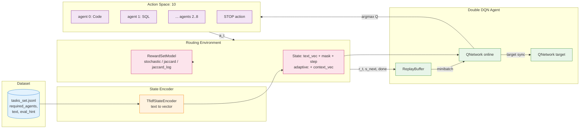
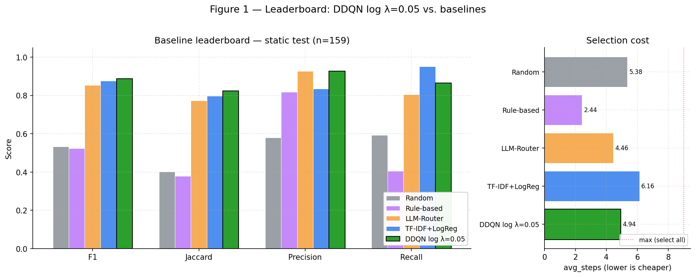
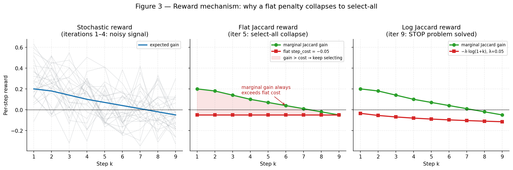
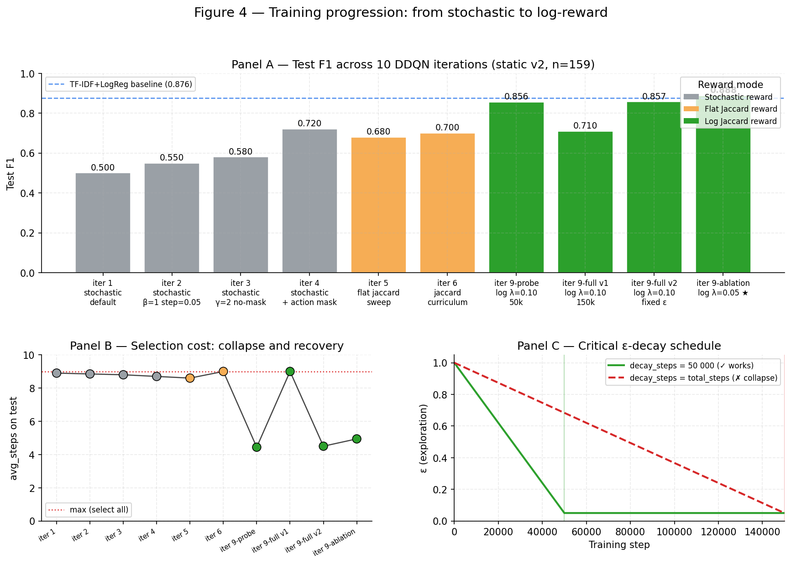
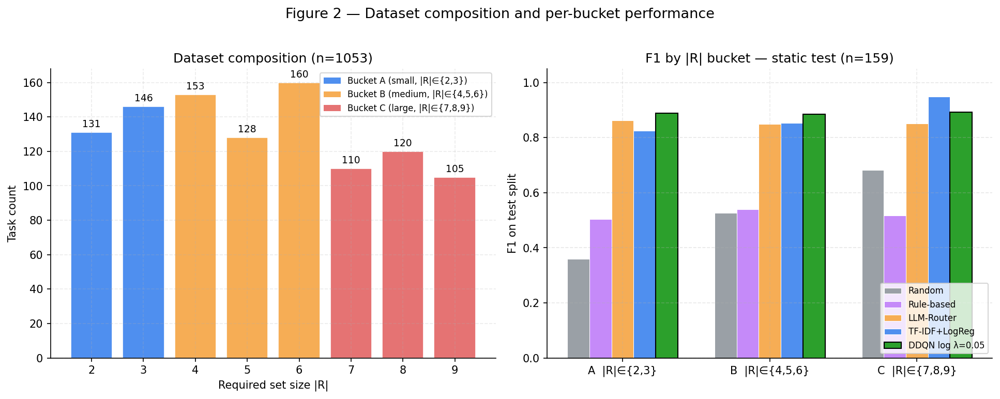

# Multi-Agent Set Routing with DQN

This repository studies **routing a user request** through a network of 9 specialized agents. For each request, the goal is to choose the **optimal set of agents** (from 2 to 9), minimizing both under-selection and over-selection.

More detail is available in the [Research Plan](Research_Plan_MultiAgent_Set_Routing_v1.0.0.md). The full run history is documented in [EXPERIMENT_LOG.md](EXPERIMENT_LOG.md).

> **Dataset language note:** the dataset was originally designed and annotated in Russian. The documentation is now in English, but the source request texts and some dataset examples remain Russian by design.

## System Architecture

The diagram below shows the end-to-end flow for one training step. A request enters the TF-IDF state encoder; the Double DQN agent emits an action (either select an agent `0..8` or `STOP`); the environment updates its mask and computes the reward via the selected reward model.



Code entry points: dataset loading in [src/multiagent_dqn_routing/data/dataset.py](src/multiagent_dqn_routing/data/dataset.py), state encoding in [src/multiagent_dqn_routing/rl/state_encoder.py](src/multiagent_dqn_routing/rl/state_encoder.py), environment step in [src/multiagent_dqn_routing/envs/set_routing_env.py](src/multiagent_dqn_routing/envs/set_routing_env.py), reward in [src/multiagent_dqn_routing/sim/reward_set.py](src/multiagent_dqn_routing/sim/reward_set.py), agent in [src/multiagent_dqn_routing/rl/ddqn_agent.py](src/multiagent_dqn_routing/rl/ddqn_agent.py), and the training loop in [src/multiagent_dqn_routing/experiments/train_ddqn_set.py](src/multiagent_dqn_routing/experiments/train_ddqn_set.py).

## Results Summary



*Figure 1 — Leaderboard on the static test split (n=159). Left: F1/Jaccard/Precision/Recall per method; DDQN with log reward (`λ=0.05`) leads every metric except Recall, where TF-IDF+LogReg wins at the cost of selecting more agents. Right: `avg_steps` is a direct cost proxy — DDQN reaches best F1 while picking ~1.2 fewer agents than TF-IDF+LogReg.*


### Static dataset v2 (test n=159)

| Method | F1 | Jaccard | Precision | Recall | avg_steps | cost_ratio |
|---|---|---|---|---|---|---|
| Random | 0.533 | 0.402 | 0.580 | 0.593 | 5.38 | — |
| Rule-based | 0.523 | 0.379 | 0.819 | 0.406 | 2.44 | — |
| LLM-Router | 0.854 | 0.773 | 0.928 | 0.804 | 4.46 | — |
| TF-IDF + LogReg | 0.876 | 0.797 | 0.836 | 0.952 | 6.16 | 1.15 |
| DDQN flat reward (iter 4) | 0.721 | 0.600 | 0.601 | 0.995 | 8.70 | 1.62 |
| **DDQN log λ=0.05 (iter 9)** | **0.888** | **0.824** | **0.927** | **0.865** | **4.94** | **0.931** |

### Adaptive dataset (test n=131)

| Method | F1 | Jaccard | Precision | Recall | avg_steps |
|---|---|---|---|---|---|
| Random | 0.512 | 0.380 | — | — | 5.44 |
| Rule-based | 0.528 | 0.388 | — | — | 2.37 |
| TF-IDF + LogReg | 0.885 | 0.813 | 0.879 | 0.920 | 5.13 |
| DDQN adaptive flat (iter 7) | 0.652 | 0.517 | 0.551 | 0.892 | 7.76 |
| DDQN adaptive log λ=0.05 (iter 10) | 0.668 | 0.532 | 0.568 | 0.938 | 8.05 |

## Project Structure

```text
multiagent_dqn_routing/
├── configs/                     # All baseline/DDQN/smoke configs; full list below
├── data/                        # Main and adaptive datasets + stratified splits
├── artifacts/                   # Recorded baseline/DDQN artifacts
├── docs/figures/                # README figures (regenerated from artifacts)
├── tools/                       # Data-preparation scripts, snapshot protocol, plot_figures.py
├── src/multiagent_dqn_routing/
│   ├── data/                    # JSONL dataset loading
│   ├── envs/                    # Static and adaptive routing environments
│   ├── eval/                    # Set metrics, bucket evaluation, cost_ratio
│   ├── experiments/             # Baselines, DDQN training, snapshot utils
│   ├── rl/                      # Replay buffer, Q-network, state encoder, DDQN agent
│   ├── sim/                     # Reward models: stochastic / jaccard / jaccard_log
│   └── agents.py                # Definition of the 9 specialized agents
├── EXPERIMENT_LOG.md
├── Research_Plan_MultiAgent_Set_Routing_v1.0.0.md
├── pyproject.toml
├── requirements.txt
└── README.md
```

## Quick Start

### Installation

> **Important:** use an isolated virtual environment so the project dependencies do not conflict with system packages.

```bash
python -m venv .venv
source .venv/bin/activate        # macOS / Linux
# .venv\\Scripts\\activate      # Windows

pip install -e '.[dev]'

# For a lock-style environment:
pip install -r requirements.txt
pip install -e .
```

Dependencies are declared in `pyproject.toml`:
- **core**: `numpy`, `scipy`, `scikit-learn`, `joblib`, `torch`
- **dev**: `matplotlib`, `pandas`, `tqdm`

> **Note:** `artifacts/` and `cache/` are script-generated. Only the artifacts needed for reporting and reproducibility are kept in the repository.

### Data Preparation

```bash
# Convert TSV -> JSONL (if you edited the draft file)
python tools/tsv_to_jsonl.py

# Validation and statistics
python tools/dataset_stats_set.py

# Stratified split for the main dataset
python tools/split_jsonl_set.py

# Stratified split for the adaptive dataset
python tools/split_adaptive_dataset.py
```

To generate `data/tasks_set_adaptive_full.jsonl`, do not store secrets in code:

```bash
cp .env.example .env
source .env
python tools/generate_adaptive_dataset.py
```

## Reproducing the Best Result (DDQN λ=0.05)

```bash
# 1. Install
python -m venv .venv && source .venv/bin/activate
pip install -e '.[dev]'

# 2. Prepare data (if the splits do not exist yet)
python tools/split_jsonl_set.py

# 3. Run the best configuration
python -m multiagent_dqn_routing.experiments.train_ddqn_set \
    --config configs/ddqn_log_lambda005_full.json

# 4. Expected test result:
#   mean_f1 ≈ 0.888, precision ≈ 0.927, avg_steps ≈ 4.94
```

### Running the Baselines

```bash
# Random baseline
python -m multiagent_dqn_routing.experiments.run_random_set

# Rule-based baseline
python -m multiagent_dqn_routing.experiments.run_rule_set

# Supervised baseline
python -m multiagent_dqn_routing.experiments.run_supervised_set

# LLM-Router (requires an API key)
export LLM_API_KEY=sk-...
python -m multiagent_dqn_routing.experiments.run_llm_set
```

Adaptive baseline runs use `data/splits_adaptive/*.jsonl` and the reward settings from `configs/baseline_protocol.json`; aggregated results are recorded in [EXPERIMENT_LOG.md](EXPERIMENT_LOG.md).

### Training Double DQN

```bash
# Best configuration on static v2
python -m multiagent_dqn_routing.experiments.train_ddqn_set \
    --config configs/ddqn_log_lambda005_full.json

# Historical stochastic-reward experiments (iterations 1-4)
python -m multiagent_dqn_routing.experiments.train_ddqn_set \
    --config configs/ddqn_set_beta1_step005_gamma2_actionmask.json

# Jaccard reward / curriculum
python -m multiagent_dqn_routing.experiments.train_ddqn_set \
    --config configs/ddqn_jaccard_step005.json
python -m multiagent_dqn_routing.experiments.train_ddqn_set \
    --config configs/ddqn_jaccard_curriculum.json

# Adaptive env
python -m multiagent_dqn_routing.experiments.train_ddqn_set \
    --config configs/ddqn_adaptive_jaccard.json
python -m multiagent_dqn_routing.experiments.train_ddqn_set \
    --config configs/ddqn_adaptive_jaccard_v2.json
python -m multiagent_dqn_routing.experiments.train_ddqn_set \
    --config configs/ddqn_adaptive_log_lambda005.json

# Smoke-check any config
python -m multiagent_dqn_routing.experiments.train_ddqn_set \
    --config configs/ddqn_log_lambda005_full.json --smoke_test
```

DDQN artifacts are saved to `artifacts/ddqn/` (`model.pt`, `encoder.joblib`, `metrics_val_best.json`, `metrics_test.json`, `config_used.json`). Historical smoke configs are kept in `configs/` for exact reproducibility, but for normal use the `--smoke_test` flag is sufficient.

### Regenerating README Figures

All four figures embedded in this README (leaderboard, dataset composition, reward mechanisms, training progression) are produced from `artifacts/*.json` and the milestones recorded in [EXPERIMENT_LOG.md](EXPERIMENT_LOG.md). To refresh them after a new experiment run:

```bash
python tools/plot_figures.py
```

Outputs land in `docs/figures/*.png`. The script has no dependencies beyond `matplotlib` and `numpy` (already declared in `pyproject.toml` under `[dev]`).

### Baseline Snapshot (official)

For a reproducible baseline comparison before the DQN stage, run:

```bash
python tools/baseline_snapshot.py --config configs/baseline_protocol.json
```

The script creates:
- `artifacts/baselines_summary.json`
- `artifacts/baselines_summary.md`
- `artifacts/baseline_<name>.json`

### Reward Config Used in Baselines

By default, the set-routing baseline scripts (`run_random_set.py`, `run_rule_set.py`, `run_supervised_set.py`, `run_llm_set.py`) use:

- `alpha = 1.0`
- `beta = 0.5`
- `gamma = 1.0`
- `p_good = 0.85`
- `p_bad = 0.30`

For the official snapshot, the reward is taken from `configs/baseline_protocol.json`, where `p_bad = 0.35` is currently fixed.

### Reproducibility for the Supervised Artifact

The supervised baseline saves its artifact to `artifacts/supervised_tfidf_ovr_logreg.joblib`.

- `requirements.txt` pins the working version: `scikit-learn==1.6.1`.
- The `.joblib` payload stores `sklearn_version`, `seed`, `split_paths`, `reward_params`, `created_at_utc`.
- Artifact loading validates compatibility by the sklearn `major.minor` version.

Recommended procedure after changing environments:

```bash
python -m venv .venv && source .venv/bin/activate
pip install -e '.[dev]'
python -m multiagent_dqn_routing.experiments.run_supervised_set --strict_artifact_load_check
```

## Experiment Configs

| Config | Description | Iteration |
|---|---|---|
| `baseline_protocol.json` | Official baseline snapshot | — |
| `ddqn_set_default.json` | Base DDQN with stochastic reward | 1 |
| `ddqn_set_beta1_step005.json` | `beta=1.0`, `step_cost=0.05` | 2 |
| `ddqn_set_beta1_step005_gamma2_nomask.json` | `gamma=2.0`, no action masking | 3 |
| `ddqn_set_beta1_step005_gamma2_actionmask.json` | + action masking | 4 |
| `ddqn_jaccard_step001.json` | Flat Jaccard ablation, `step_cost=0.01` | 5 |
| `ddqn_jaccard_step005.json` | Flat Jaccard, `step_cost=0.05` | 5 |
| `ddqn_jaccard_step010.json` | Flat Jaccard ablation, `step_cost=0.10` | 5 |
| `ddqn_jaccard_step020.json` | Flat Jaccard ablation, `step_cost=0.20` | 5 |
| `ddqn_jaccard_curriculum.json` | Curriculum learning on top of Jaccard reward | 6 |
| `ddqn_jaccard_curriculum_smoke.json` | Short smoke config for curriculum | 6 |
| `ddqn_adaptive_jaccard.json` | AdaptiveRoutingEnv + Jaccard reward | 7 |
| `ddqn_adaptive_jaccard_smoke.json` | Short smoke config for the adaptive env | 7 |
| `ddqn_adaptive_jaccard_v2.json` | Adaptive env + expanded TF-IDF corpus | 8 |
| `ddqn_adaptive_jaccard_v2_smoke.json` | Smoke config for iteration 8 | 8 |
| `ddqn_log_lambda010_smoke.json` | Smoke config for log reward | 9 |
| `ddqn_log_lambda010.json` | Log reward `λ=0.10` probe, 50k | 9 |
| `ddqn_log_lambda010_full.json` | Log reward `λ=0.10` full v1, plateau | 9 |
| `ddqn_log_lambda010_full_v2.json` | Log reward `λ=0.10` + `epsilon_decay_steps=50000` | 9 |
| `ddqn_log_lambda005.json` | Ablation `λ=0.05`, short probe | 9 |
| `ddqn_log_lambda005_full.json` | **Best configuration: log reward `λ=0.05`** | **9** |
| `ddqn_log_lambda003.json` | Ablation `λ=0.03` (not run) | — |
| `ddqn_log_lambda015.json` | Ablation `λ=0.15` (not run) | — |
| `ddqn_adaptive_log_lambda005.json` | Adaptive + log reward `λ=0.05` | 10 |

## Key Scientific Findings

1. **The STOP problem is structural, not parametric.** A flat `step_cost` creates a local optimum of "select all": the marginal Jaccard gain (`~0.06`) consistently exceeds any fixed per-step penalty.
2. **A logarithmic penalty breaks the local optimum.** DDQN with `λ=0.05` outperformed TF-IDF+LogReg on test F1 (`0.888 vs 0.876`), Jaccard (`0.824 vs 0.797`), and exact match (`0.440 vs 0.252`) while selecting fewer agents.
3. **The epsilon schedule is critical for sparse reward.** `epsilon_decay_steps = 50000` turned out to be necessary for success; when `epsilon_decay_steps = total_steps`, the plateau and select-all collapse reappeared.
4. **The adaptive setting needs a denser state representation.** TF-IDF `context_vec` is not strong enough to exploit intermediate agent outputs; the next candidates are dense embeddings and/or PPO.



*Figure 3 — Why the reward geometry matters (findings 1–2). Left: iterations 1–4 used a stochastic reward whose variance (grey traces) swamped the signal. Middle: a flat `step_cost = 0.05` is always smaller than the marginal Jaccard gain, so the optimal policy is to keep selecting — the "select-all" collapse. Right: a log-shaped penalty `−λ·log(1+k)` eventually exceeds the marginal gain and produces a natural STOP.*



*Figure 4 — The path from iteration 1 to the best model (findings 2–3). Panel A plots test F1 across ten DDQN iterations, colored by reward mode; the TF-IDF+LogReg baseline (`0.876`) is dashed for reference. Panel B shows the same runs in `avg_steps`: stochastic / flat-reward runs sit at the select-all ceiling (~9), then the log-reward iteration 9 drops to ~5 and back up when the ε-schedule is wrong. Panel C illustrates why: fixing `epsilon_decay_steps = 50 000` was the decisive change — the default `= total_steps` kept exploration too high and re-triggered the collapse.*

## Agents

| ID | Name | Specialization |
|----|------|----------------|
| 0 | Code Agent (Python) | Writes and fixes Python code |
| 1 | SQL Agent | SQL queries (`SELECT` / `JOIN` / `GROUP BY`) |
| 2 | Data Analysis Agent (Pandas) | Data analysis with Pandas |
| 3 | Math Formula Solver | Mathematical formulas and calculations |
| 4 | Structured Extraction Agent (JSON) | Data extraction into JSON |
| 5 | Summarization & Formatting Agent | Summarization and formatting |
| 6 | Requirements / Spec Agent | Requirements and technical specification (FR/NFR) |
| 7 | Rewrite / Style Constraints Agent | Rewriting and stylistic constraints |
| 8 | Finance / Numeric Computation Agent | Financial calculations |

## Metrics

All experiments report a common metric set (overall + 3 buckets):

**Core metrics:**
- `mean_episode_reward`: average total reward per episode; in baseline/static experiments this is the reward from `RewardSetModel`, while in adaptive/Jaccard mode it is the deterministic reward of the current environment
- `success_rate`: share of tasks with full coverage (`missing = 0`)
- `exact_match_rate`: share of tasks with an exact set match
- `mean_jaccard`: average Jaccard similarity
- `mean_precision`, `mean_recall`, `mean_f1`: standard set metrics

**Buckets by `|R|`:**
- **A** (`|R| ∈ {2,3}`): small sets
- **B** (`|R| ∈ {4,5,6}`): medium sets
- **C** (`|R| ∈ {7,8,9}`): large sets



*Figure 2 — Left: `|R|` is nearly uniform across 2..9 (balanced by design). Right: F1 on the static test split broken down by bucket. TF-IDF+LogReg still wins bucket C (large sets, where high recall is trivially rewarded), but DDQN log `λ=0.05` is the only method that stays above 0.88 in every bucket — which is why it wins overall F1.*

## Dataset Format

Each entry in `data/tasks_set.jsonl` looks like this:

```json
{
  "id": "ex_0001",
  "required_agents": [0, 2, 4],
  "eval_hint": "code + JSON extraction",
  "text": "Write a script that parses logs...",
  "notes": "Code for parsing + Structured Extraction for JSON."
}
```

- `required_agents`: sorted list of unique integers (`0..8`), length `2..9`
- `text`: request text in the original Russian dataset language
- `eval_hint`: hint for interpreting the result
- `notes`: annotation rationale (not used for training)

### Adaptive Format

Adaptive experiments use the extended JSONL file `data/tasks_set_adaptive_full.jsonl`.
It keeps the same fields as the base dataset and adds `adaptive.trajectory`:

```json
{
  "id": "gen_9_0001",
  "required_agents": [1, 2, 5],
  "text": "Prepare an SQL export and a short cohort-retention summary...",
  "adaptive": {
    "trajectory": [
      {
        "agent_id": 1,
        "agent_name": "SQL Agent",
        "output": "SQL query prepared ...",
        "remaining_gap": "Retention analysis and final summary are still needed",
        "is_last": false
      }
    ]
  }
}
```

- `adaptive.trajectory`: ordered chain of intermediate results from selected agents
- `output`: text that enters the adaptive environment's `context_vec`
- `remaining_gap`: which part of the task is still uncovered after this step
- `is_last`: indicator of the last step in the generated trajectory
